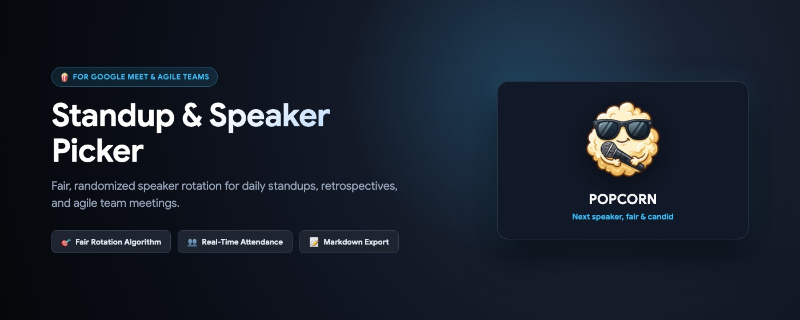
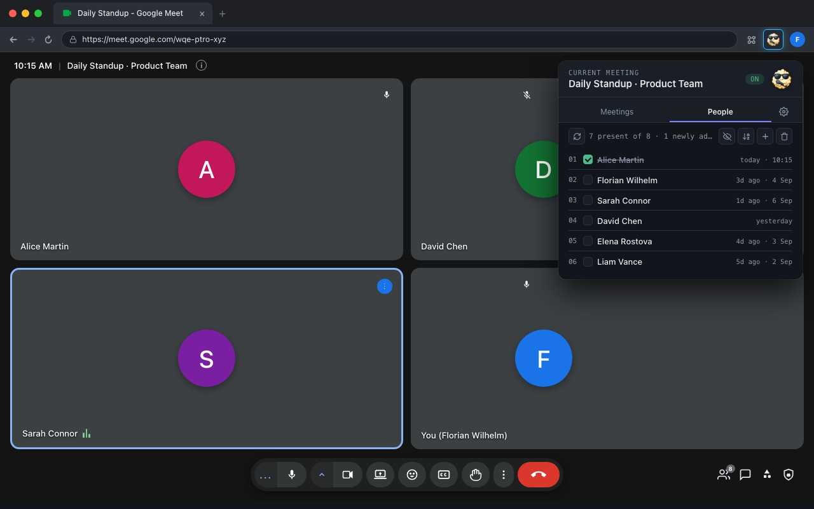
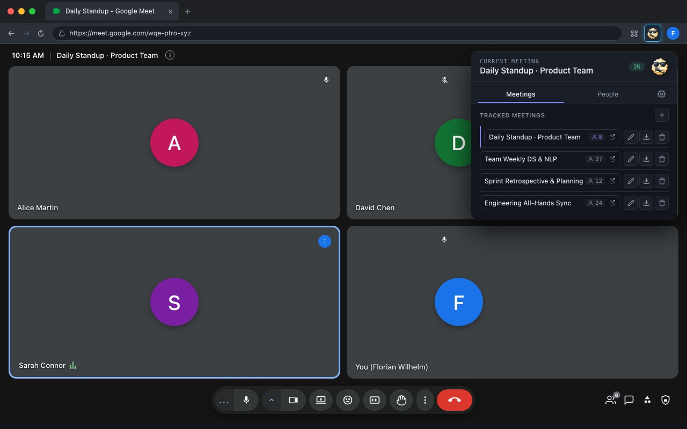
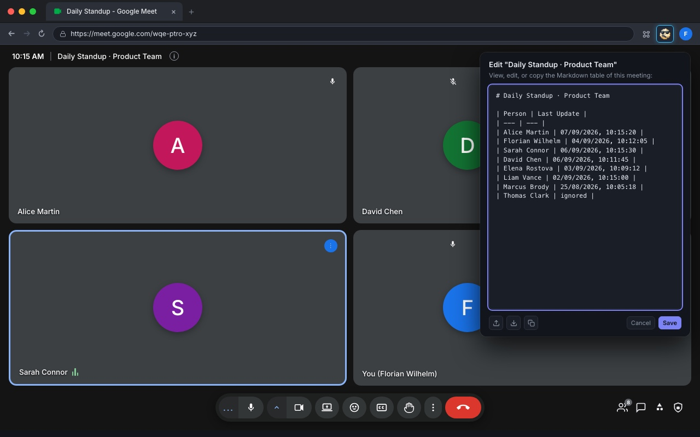

# 🍿 POPCORN – Participant Order Picker for Candid On-call Reporting & Notes

[](https://chromewebstore.google.com/detail/popcorn-%E2%80%93-google-meet-sta/ohfgelbmjoepoocbcmmlhlfcholfogmb)
[](https://jacobtomlinson.dev/effver)
[](CHANGELOG.md)
[](LICENSE)

<p align="center">
  
</p>

**POPCORN** is a lightweight, privacy-friendly Chrome extension that brings fair and effortless "Popcorn-style" speaker rotation to Google Meet. It automatically tracks when teammates last gave an update and orders candidates fairly so that everyone gets an equal turn without awkward pauses.

---

## 💡 Why POPCORN?

- **P**articipant
- **O**rder
- **P**icker for
- **C**andid
- **O**n-call
- **R**eporting &
- **N**otes

In agile culture, passing the microphone organically is known as *"Popcorn style"*. POPCORN takes away the cognitive burden of asking *"Who hasn't given an update in a while?"* while keeping standups and syncs snappy, engaging, and fair.

---

## 🚀 Key Features

- 🎯 **Fair Speaker Rotation**: Automatically suggests candidates present in the call ordered by who hasn't spoken the longest.
- ✅ **One-Click Check-Off**: Click a participant's checkbox as they finish their update to record the timestamp with an instant strikethrough.
- 👥 **Real-Time Attendance**: Syncs live attendees from Google Meet and highlights newly joined teammates.
- 🔤 **Dual Sorting Modes**: Toggle between fair rotation priority and alphabetical order with a single click—without losing priority rankings!
- 👻 **Absent & Ignored Roster**: Keep guests or passive listeners muted/ignored, or toggle visibility of absent members.
- 📅 **Multi-Meeting Tracking**: Manages independent rosters and histories for multiple daily standups, weekly syncs, and retros.
- 📝 **Markdown Roster & Table Editor**: View, edit, copy, and export/import meeting rosters directly as clean Markdown tables—ideal for Notion, Obsidian, GitHub, Slack, and Docs.
- 🔒 **Zero Telemetry / 100% Local**: All data remains strictly in your browser's `chrome.storage.local`. No analytics, no accounts, and no external servers.

---

## 🛠️ Installation

### Option 1: Chrome Web Store (Recommended & Quickest)
Install POPCORN directly from the official Google Chrome Web Store with automatic background updates:

👉 **[Install from Chrome Web Store](https://chromewebstore.google.com/detail/popcorn-%E2%80%93-google-meet-sta/ohfgelbmjoepoocbcmmlhlfcholfogmb)**

### Option 2: Pre-built Release Bundle (.zip)
1. Download the `popcorn-v*.zip` bundle from the latest [GitHub Release](https://github.com/FlorianWilhelm/popcorn/releases).
2. Unzip the downloaded file into a folder.
3. In Chrome (or any Chromium browser like Brave or Edge), navigate to `chrome://extensions`.
4. Enable **Developer mode** in the top-right corner.
5. Click **Load unpacked** and select the unzipped folder.

### Option 3: From Source (Developers)
1. Clone this repository: `git clone https://github.com/FlorianWilhelm/popcorn.git`
2. In Chrome, navigate to `chrome://extensions`.
3. Enable **Developer mode** in the top-right corner.
4. Click **Load unpacked** and select the `src/` directory in this repository.

> 💡 **Tip:** Whichever installation option you choose, remember to pin **POPCORN (🍿)** to your extension toolbar (via Chrome's puzzle piece icon 🧩) so it is always one click away during calls.

---

## 📖 How It Works

### 1. Daily Standup & Speaker Rotation (People Tab)

When you are in a Google Meet call, open the POPCORN popup to see the active standup rotation:

<p align="center">
  
</p>

- **Real-Time Presence:** The top status bar indicates how many attendees are currently present in Google Meet (`7 present of 8 · 1 newly added`). Click **🔄 Refresh** anytime to re-sync attendance.
- **Checking Off Speakers:** As each teammate speaks, check their box. POPCORN timestamps their update (`today · 10:15`) and applies a strikethrough.
- **Fair Ordering:** Teammates who haven't spoken the longest naturally bubble to the top of the list.
- **Toolbar Controls:**
  - 👻 **Ghost Icon:** Toggle visibility of absent and ignored members in a secondary list below the main rotation.
  - 🔤 **Sort Icon:** Switch between rotation order and alphabetical view (while preserving priority numbers `01`, `02`, ...).
  - ➕ **Add Icon:** Add an attendee manually to the current meeting.
  - 🗑️ **Trash Icon:** Toggle delete mode to quickly prune former teammates.

---

### 2. Multi-Meeting Management (Meetings Tab)

Switch to the **Meetings** tab to see and manage all your tracked teams and recurring calls:

<p align="center">
  
</p>

- **Meeting Overview:** See all tracked meetings, inline-editable meeting names, attendee counts, and the currently active meeting indicator.
- **Quick Actions:**
  - ↗️ **Open Meeting:** Switch directly to the People roster and rotation for that meeting.
  - 📝 **Markdown Editor:** Open the in-app Markdown roster editor for that meeting.
  - 💾 **Export Meeting:** Download the meeting's roster and update history as a `.md` file.
  - 🗑️ **Delete Meeting:** Stop tracking and delete meeting history.
- **Add / Import:** Click the **➕** button at the top to create a new meeting or paste in an existing Markdown table.

---

### 3. In-App Markdown Roster & Table Editor

POPCORN treats Markdown as a first-class citizen. Click the **Edit Markdown** button on any meeting to open the interactive editor:

<p align="center">
  
</p>

- **Live Markdown Table:** View and edit meeting attendance and update timestamps in clean GFM (GitHub Flavored Markdown) table format.
- **📋 Copy:** Instantly copy the table to your clipboard for pasting into daily meeting notes, Notion, Obsidian, GitHub issues, or Slack.
- **📂 Load File:** Import an existing Markdown roster file directly from your disk.
- **💾 Save:** Edits made in the Markdown table immediately sync back to POPCORN's internal storage.

---

### 4. Settings & Backups (⚙️ Tab)

Click the **⚙️ Settings** icon in the tab bar to customize your setup:
- **Attendance Refresh:** Configure automatic refresh intervals for Google Meet calls.
- **Full Database Backup:** Export your entire POPCORN configuration and history as JSON.
- **Restore Backup:** Import previously exported JSON backup files anytime.

---

## 🏷️ Versioning & Changelog

This project strictly follows **[EffVer (Intended Effort Versioning)](https://jacobtomlinson.dev/effver/)** (`Macro.Meso.Micro`) and documents all notable changes in **[CHANGELOG.md](CHANGELOG.md)** based on [Keep a Changelog](https://keepachangelog.com/).

- **Macro**: Significant effort required to adopt (major overhauls, extensive breaking changes).
- **Meso**: Some small effort required to adopt (minor breaking adjustments, changes affecting workarounds).
- **Micro**: No effort required (bug fixes, enhancements, seamless updates).

To bump the version across all project files, run:
```bash
npm run bump -- micro    # No effort to adopt (e.g. 0.28.0 -> 0.28.1)
npm run bump -- meso     # Some effort to adopt (e.g. 0.28.0 -> 0.29.0)
npm run bump -- macro    # Large effort to adopt (e.g. 0.28.0 -> 1.0.0)
```

---

## 📄 License

Distributed under the [MIT License](LICENSE). Feel free to use and adapt for your team's standups!

